# Creating an OS

This repository showcases  stages of OS development using x86 assembly language. The project is structured into multiple tasks, each building upon the previous one to introduce new concepts and functionalities.

***
# Part 1: Bootloader & Basic Kernel

##  Project Progression & Step Summary

###  Step 1.1: Initialising the Multiboot header
The first step was to create the `loader.asm` file which contains the Multiboot header necessary for booting the OS.

* **Functionality:** Initializes the Multiboot header to ensure compatibility with Multiboot-compliant bootloaders.
* **Key Concept:** Understanding the Multiboot specification and setting up the required header fields. 

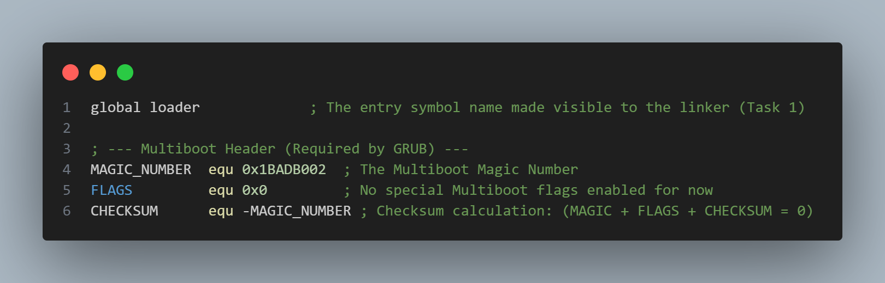
The code above shows the Multiboot header that is required to boot the OS. It contains the `magic number`, `flags`, and `checksum` to ensure compatibility with Multiboot-compliant bootloaders. Alsom it contains the `loader` label which is the entry point of the OS. In this task, I also loaded a test value into the `EAX` register to ensure that the OS is booting correctly. Then i used this command to compile the file:
```bash
nasm -f elf32 loader_task1.asm -o loader_task1.o
```
---

###  Step 1.2: creating the linker file 

This task involved creating a linker script (`link.ld`) to define the memory layout of the OS.

* **Functionality:**  Defines the memory layout for the OS, specifying sections for code, data, and BSS.
* **Key Concept:**  Understanding linker scripts and memory organization in low-level programming.

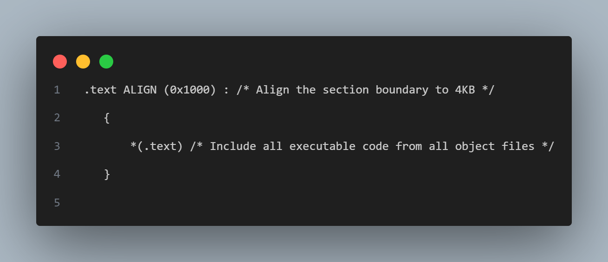
The code above shows a section of the linker script that defines the memory layout of the OS. It specifies the sections for `.text` and aligns a boundary of 4KB for each section. The `ENTRY(loader)` directive sets the entry point of the OS to the `loader` label defined in the assembly file. In this task, I also used this command to link the object file:
```bash
ld -T ./src/link.ld -melf_i386 loader.o -o kernel.elf
```
this command links the object file `loader.o` using the linker script `link.ld` and produces an executable file named `kernel.elf`.

---

###  Step 1.3: creating the GRUB  bootloader and bootable ISO image 

This task involved copying a file called `stage2_eltorito` from the GRUB package to the project directory using `cp` in the terminal, making `menu.lst`which will tell the GRUB where the kernel is and creating a bootable ISO image using GRUB.

* **Functionality:**
    1.  find the `stage2_eltorito` file in the GRUB package and copy it to the project directory.
    2.  create a `menu.lst` file that tells GRUB where the kernel is located.
    3.  create a bootable ISO image using GRUB with the kernel and `menu.lst`.
* **Key Concept:** Understanding the GRUB bootloader and creating bootable ISO images.
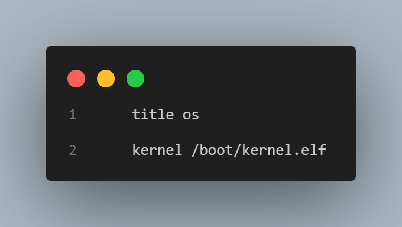
The code above shows the `menu.lst` file that tells GRUB where the kernel is located. It specifies the title of the OS, the location of the kernel, and the boot options.
Now the GRUB was set up, the next step was to create a bootable ISO image using the following command:
```bash
genisoimage -R              \
		-b boot/grub/stage2_eltorito    \
		-no-emul-boot                   \
		-boot-load-size 4               \
		-A os                           \
		-input-charset utf8             \
		-quiet                          \
		-boot-info-table                \
		-o os.iso                       \
		iso
```
this command creates a bootable ISO image named `os.iso` using the GRUB bootloader and the kernel located in the `iso/boot` directory.
the final step was to test the ISO image using QEMU with the following command:
```bash
qemu-system-i386 -nographic -boot d -cdrom os.iso -m 32 -d cpu -D logQ.txt
```
this command runs the ISO image `os.iso` in QEMU with 32MB of memory and outputs the CPU debug information to a file named `logQ.txt`.
after running the command you need to press `Ctrl+A X` to exit QEMU. after that you can check the `logQ.txt` file to see if the test value `0xCAFREBABE` was loaded into the `EAX` register correctly.
Using `grep` command to search for the value in the log file:
```bash
grep "cafebabe" logQ.txt
```
this should show this output:
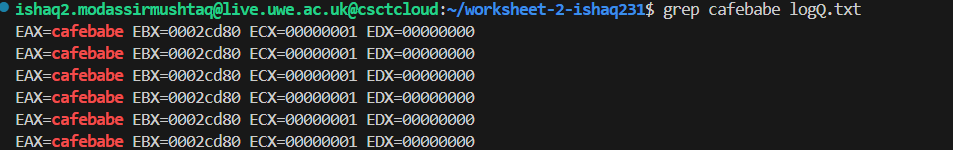
the reason there are multiple entries of `cafebabe` is because the OS is running in a loop and the value is being loaded into the `EAX` register multiple times.
in the end i combined all the commands into a `Makefile` to automate the build process.


***

###  Step 2: extending kernel to call C files
This task involved extending the kernel to call C functions from assembly code, allowing for more complex operations and easier code management.
* **Functionality:**
    1.  add C function declarations in the assembly file
    First had to declare the C functions in the assembly file using the `extern` directive. this tells the assembler that these functions are defined in another file.
    Then i had to set up the stack frame for calling C functions. This involves aligning the stack pointer and preparing any necessary arguments. I  the `kernel_stack` label to define the stack space for the kernel. and i saved the starting point of the stack to the `esp` register. This is the implementaion below:
    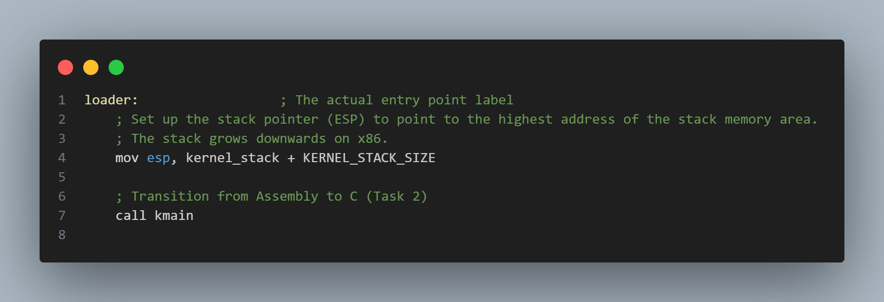
    as you can see above `call` instruction is used to call the C function from `kmain.c` file. 
    2.  implement C functions to perform specific tasks
    There are 3 C functions implemented in the `kmain.c` file:
    * `sum_of_three_numbers`: This function takes three integers as input and returns their sum.
    * `multiply_two_numbers`: This function takes two integers as input and returns their product.
    * `is_odd`: This function takes an integer as input and returns 1 if the number is odd, and 0 if it is even.
    Then `asm volatile` was used to save the results of these functions into the `EAX`, `EBX`, and `ECX` registers respectively. This allows the assembly code to access the results of the C functions after they have been called. 
    When the OS is run in QEMU, we can search for the results in the log file using `grep` command.
    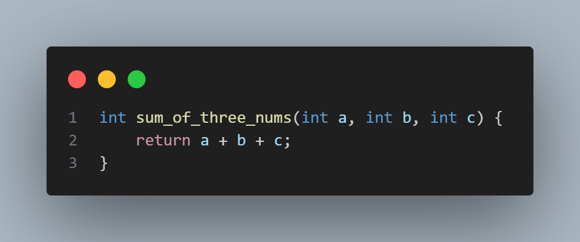
    this is implementaion for `sum_of_three_numbers` function.

    3.  compile and link the assembly and C files together
    Finally, I compiled the assembly and C files together using the following commands:
    ```bash
    nasm -f elf loader.asm -o loader.o
    gcc -m32 -nostdlib -nostdinc -fno-builtin -fno-stack-protector \
		-nostartfiles -nodefaultlibs -Wall -Wextra -Werror -c \
		src/kmain.c -o kmain.o
    ld -m elf_i386 -T link.ld -o kernel.elf loader.o kmain.o -o kernel.elf
    ```


* **Key Concepts:** Interfacing between assembly and C, function calling conventions, and basic C programming.


here it is shown that the results of the C functions are correctly loaded into the registers.


***

# Step 3: Creating Framebuffer and API and printing Results

## Overview
This task involved building a complete, modular API for all console I/O, including:
- **Framebuffer**
- **Serial Port**

---

## Functionality

###  Framebuffer Driver (`framebuffer.c`)
- `fb_write_cell`: Writes a character cell to the framebuffer
- `fb_move_cursor`: Moves the hardware cursor

###  Serial Port Driver (`terminal.c`)
- Configures the serial port
- `serial_write`: Provides logging functionality

###  High-Level API (`My_API.c`)
- `fb_clear()`: Clears the entire screen to black
- `set_color(fg, bg)`: Sets active foreground/background color for subsequent text
- `fb_move(x, y)`: 2D cursor control, synchronizing hardware + software cursor states
- `int_to_str(n, s)`: Custom `itoa` implementation to convert integers to strings
- `fb_write(buf, len)`: High-level string function that:
  - Handles newlines (`\n`)
  - Manages screen scrolling


Here is in example the functions beign used in the `kmain.c` file to demonstrate the functionality of the framebuffer and API drivers.


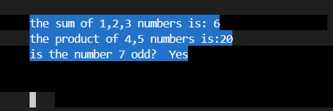

Above is the output of the OS when run in QEMU, demonstrating the framebuffer functionality. Also the cursor is placed 3 lines below the last line, this is because the `fb_move` function was used to move the curser 3 lines down after the last line.

## Key Concepts
- **Modular driver design**
- **Hardware interaction** via:
  - I/O ports (`io.asm`)
  - MMIO (`framebuffer.c`)
- **Custom utilities**:
  - String manipulation
  - Number conversion
- **Compilation with `-nostdlib`** requires self-built utilities

---


# Part 2: Inputs & Interrupts

This section covers the implementation of interrupt handling, keyboard input processing, and the creation of an interactive terminal shell.

## Step 1: Display Keyboard Input

This task involved setting up the infrastructure to handle hardware interrupts, specifically from the keyboard, and displaying the typed characters on the screen.

### Functionality:

1. **Interrupt Descriptor Table (IDT)**: Configured the IDT to tell the CPU how to handle different interrupts.
2. **Programmable Interrupt Controller (PIC)**: Remapped the PIC to avoid conflicts with CPU exceptions and unmasked IRQ1 (Keyboard).
3. **Interrupt Handler**: Implemented `interrupt_handler` in `interrupts.c` to catch the keyboard signal.
4. **Keyboard Driver**: Created `keyboard.c` to read scan codes from I/O port `0x60` and convert them into ASCII characters.
5. **Screen Output**: Integrated with the framebuffer to display typed characters, handle Backspace (erasing characters), and Enter (moving to a new line).

**Key Concept**: Handling asynchronous hardware events using Interrupt Service Routines (ISRs) and communicating with I/O ports.


The above screenshot shows the output of the OS running in QEMU. It demonstrates the ability to type characters.
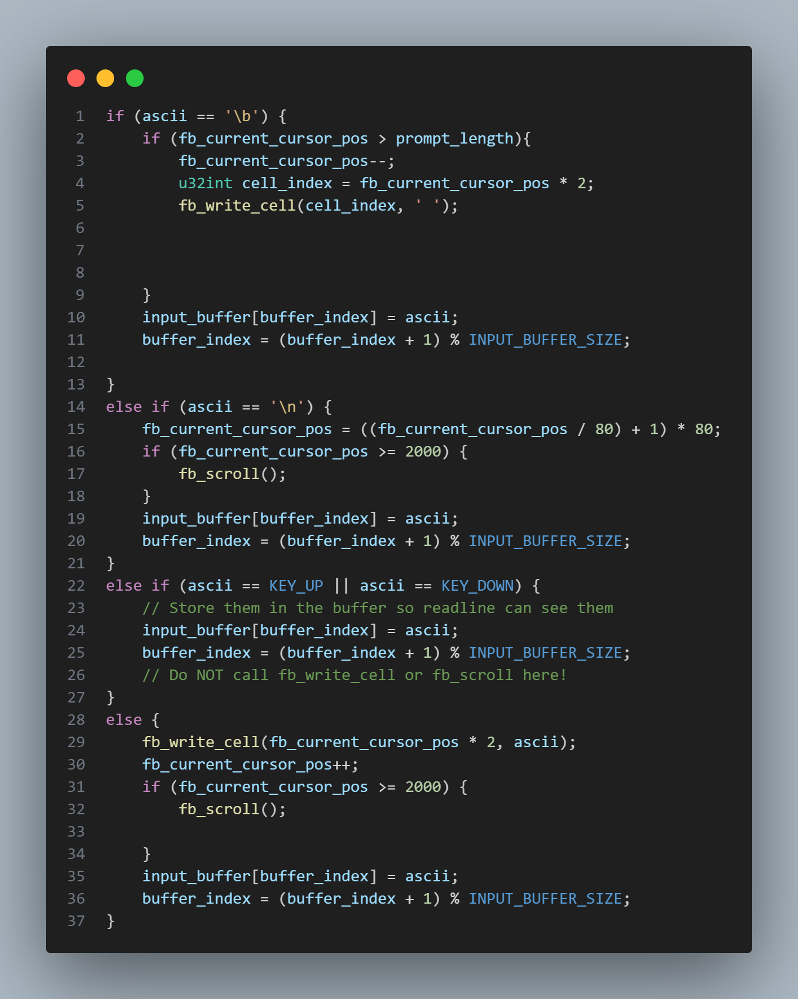
The above screenshot shows the implementation of the `interrupt_handler` function in `interrupts.c` file. This function is responsible for handling keyboard interrupts and displaying the typed characters on the screen. and it also handle arrow keys so previos commands can be accesed whe pressed.

---

## Step 2: Input Buffer API

To manage the asynchronous nature of keyboard interrupts, I implemented a circular buffer API. This ensures that fast typing isn't lost while the system is processing other tasks.

### Functionality:

1. **Circular Buffer**: Implemented a fixed-size `input_buffer` in `interrupts.c` where the interrupt handler stores incoming characters.
2. **`getc()`**: A function in `input_buffer.c` that retrieves a single character from the buffer. It temporarily disables interrupts to safely modify read indices.
3. **`readline()`**: A higher-level function that repeatedly calls `getc()` to build a string until the user presses Enter (`\n`). It handles buffer limits to prevent overflows.

**Key Concept**: Producer-Consumer problem and synchronization (disabling interrupts) to prevent race conditions between the interrupt handler and the main kernel loop.

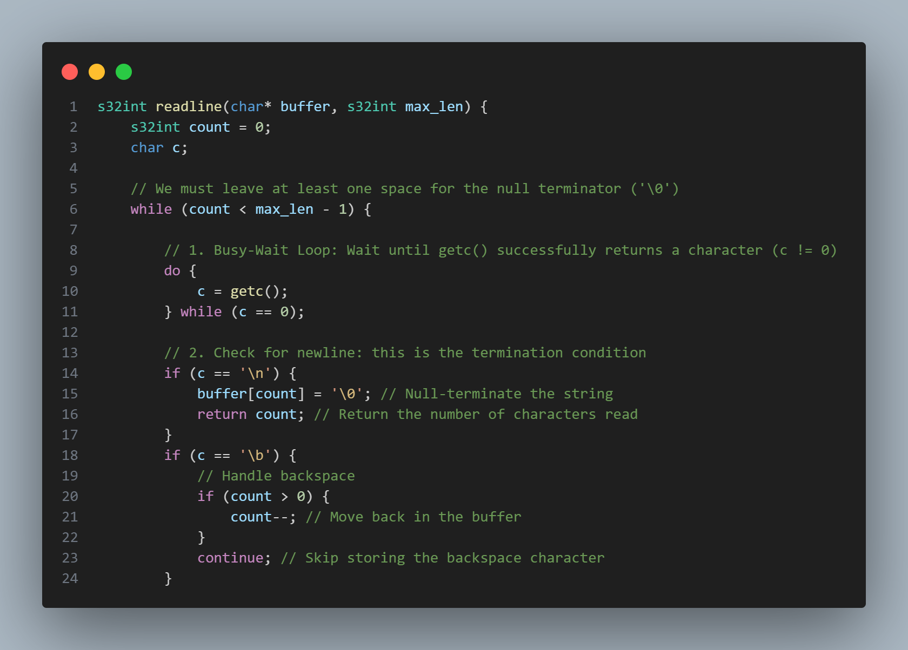
The above screenshot shows the implementation of the `readline` function in `input_buffer.c` file. This function reads characters from the input buffer until a newline character is encountered, building a complete string for further processing.

---

## Step 3: Terminal Implementation

The final task was to build a command-line interface (Shell) that allows the user to interact with the OS using commands.

### Functionality:

1. **Command Loop**: Created `run_terminal()` in `terminal.c` which prints a prompt (`myos> `), waits for input using `readline()`, and processes the result.
2. **String Parsing**: Implemented helper functions like `strcmp` to compare user input against known command names.
3. **Command Execution**: Implemented a system to map commands to specific functions.
4. **Implemented Commands**:
   - `echo [text]`: Prints the text back to the screen.
   - `cls`: Clears the framebuffer.
   - `help`: Displays a list of available commands.
   - `bye`: Sends a shutdown signal to QEMU (using specific I/O ports `0x604` and `0x2000`).
   - `func1`: runs the sum of three numbers function from kmain.c with user input.
   - `func2`: runs the multiply two numbers function from kmain.c with user input.
   - `func3`: runs the is_odd function from kmain.c with user input.


**Key Concept**: Building a Read-Evaluate-Print Loop (REPL) and basic string manipulation in a C environment without standard libraries.

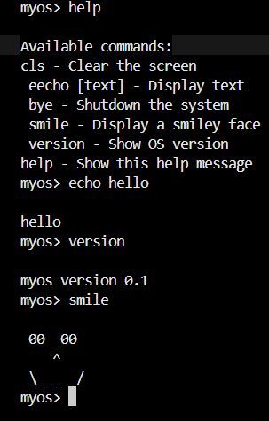
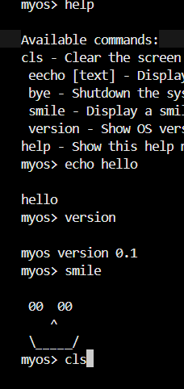

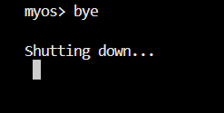
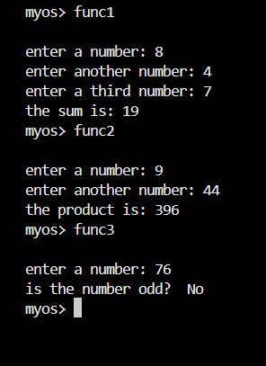

---

## Step 4: File System simulation and more Commands
- **access to previous commands**: implemented in the `interrupt_handler` function to allow users to navigate through their command history using the Up and Down arrow keys.
- **File System Commands**: Implemented basic file system commands such as `ls`, `cat`, `add`, and `edit` to manage text files within the OS.
there is also error handling for the file system commands to ensure robustness.
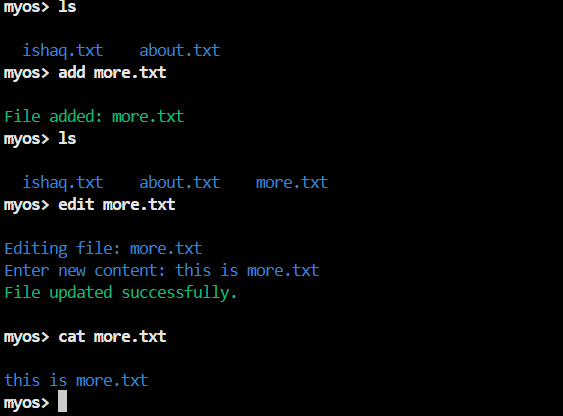
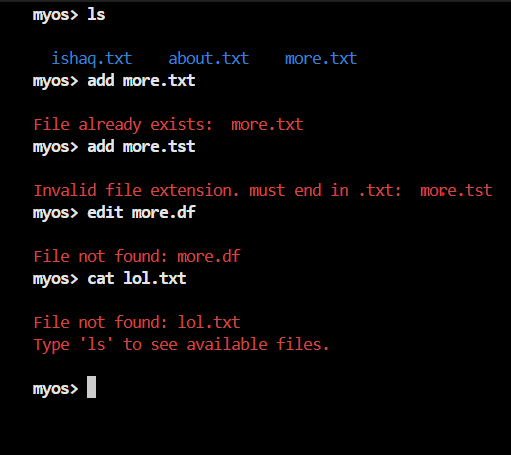
---
##  Build and Execution Instructions (Linux/x86)


1.  **Compile all files and make kernel and run OS** Use Make to compile all the files.
    ```bash
    make all
    ```
2.  **exit OS** Use the following command in new terminal to exit the OS running in QEMU.
    ```bash
    telnet localhost 45458
    ```
    then type `quit` and press enter to exit the OS.
    
3.  **clear the executable files:** Use make to clear the executablle files.
    ```bash
    make clean
    ```
